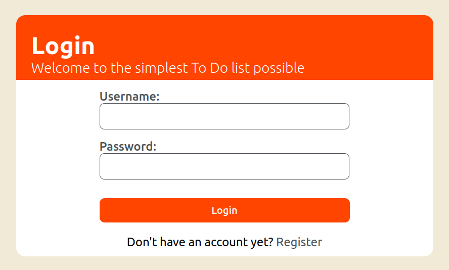
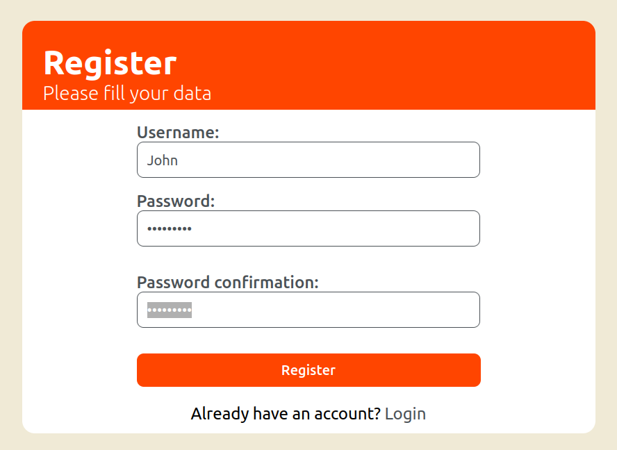
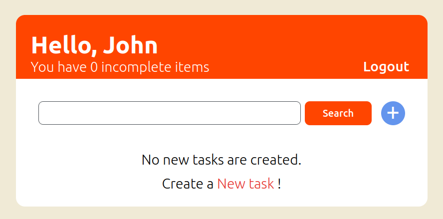
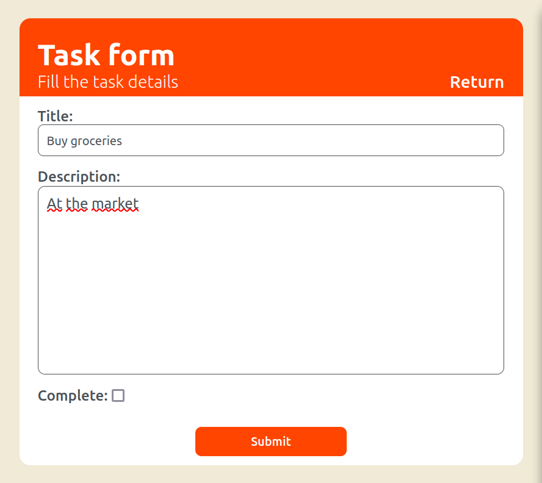
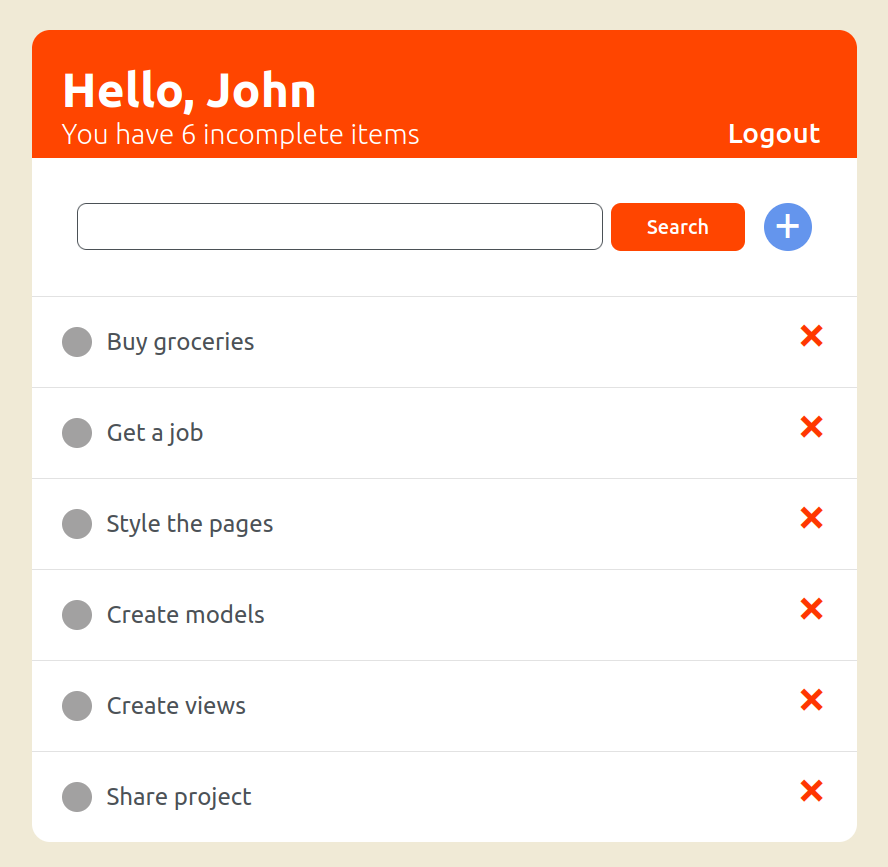
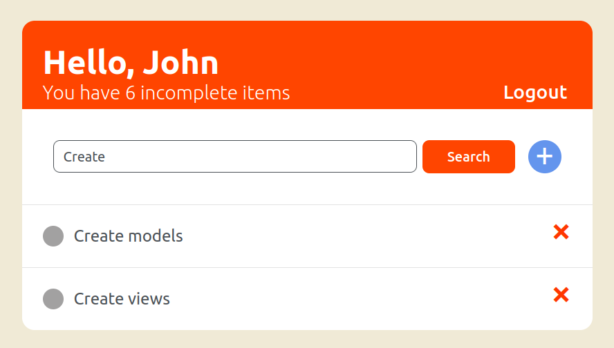
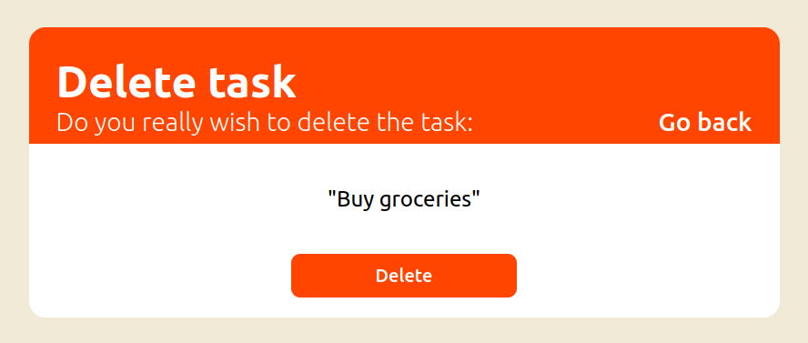
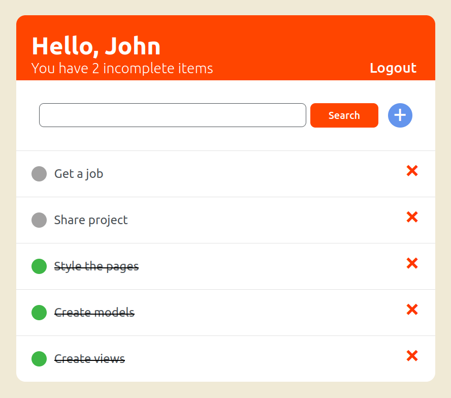

# python-django-todo-list
This is a to do list web app with CRUD operations. It is based on [this Dennis Ivy's video](https://www.youtube.com/watch?v=llbtoQTt4qw).

## Usage
Make sure you have Python 3 intalled and run:
```bash
pip install -r requirements.txt
```
⚠️ *Ideally*, install the requirements on a separate environment. To do so, before ```pip istall ...```, run the following command:
```bash
pip python3 -m venv .venv
```
If that does not work try replacing ```python3``` with ```python```. The ```.venv``` may be replaced by whatever you wish to name your virtual environment.

Once installation is complete go to the terminal, enter the "todo_list" directory:
```bash
.
├── images
└── todo_list
    ├── base
    └── todo_list (⚠️ this one)
```
and run the command:
```bash
python manage.py runserver
```

the output should be something like:
```bash
System check identified no issues (0 silenced).
February 16, 2024 - 16:42:59
Django version 5.0.2, using settings 'todo_list.settings'
Starting development server at http://127.0.0.1:8000/
Quit the server with CONTROL-C.
```

Go to the URL provided for the server (in this case ```http://127.0.0.1:8000/```) and start using.

## Features
On this application, the users can **login**
<br>

Or **Register**, if they don't have an account yet
<br>

Once registered (logged on), users are redirected to their **task list**
<br>

Where they can **create tasks**, that should be empty at first (or if all tasks are removed)
<br>

**View** their tasks
<br>

**Filtering** is also possible
<br>

As well as **deleting tasks**
<br>

And **editing** them
<br>

Tasks marked as **complete** will be shown under, so users can focus on pending tasks
<br>

The font used is [Ubuntu](https://fonts.google.com/specimen/Ubuntu).